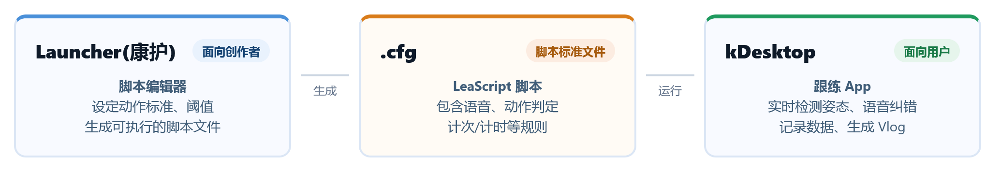

<div align="center">

# LeaScript

**面向端侧 / 视觉跟练的动作脚本规范**

`LeaScript` 是兰栖科技（Leagor）开源的动作脚本生态。它专为端侧离线视觉动作识别设计，底层支持 MediaPipe，全程无需联网，确保数据隐私安全。

[📖 规范文档](https://www.cswamp.com/post/365) | [🛠️ Launcher 编辑器](https://www.cswamp.com/post/362) | [📱 kDesktop 跟练 App](https://www.cswamp.com/post/326) | [🌐 官方网站](https://www.cswamp.com)

</div>

---

## 💡 什么是 LeaScript？

传统的健身跟练是“单向”的：UP主发视频，粉丝跟着做。粉丝做没做对，没人知道。
LeaScript 将健身动作转化为**可执行、可判定、可验证的端侧脚本**。

它提供了一个完整的闭环：
1. **定义（编写）**：由创作者通过 `Launcher` 定义标准动作、阈值和语音反馈。
2. **分发（运行）**：普通用户通过 `kDesktop` 加载脚本，利用手机摄像头进行本地姿态识别。
3. **验证（反馈）**：不符合标准的动作会被系统锁定并给予语音提示，练完后自动生成长达 30 天的数据看板。

## 🏗️ 生态架构

LeaScript 生态由三个核心部分组成，分为以下角色：

| 模块 | 角色 | 说明 |
| :--- | :--- | :--- |
| **LeaScript** | 底层规范 | 定义动作脚本的语法、数据结构、姿态判断引擎与坐标运算规则。 |
| **Launcher (康护)** | 编辑器 | 面向UP主/教练的 GUI 工具。输入视频/图片生成骨架，一键导出 `.cfg` 脚本文件。 |
| **kDesktop** | 跟练 App | 面向普通用户。加载脚本，利用后置摄像头进行毫秒级姿态校验、语音纠错与 Vlog 生成。 |

### ⚙️ 生态逻辑与流程图


## 🔒 隐私与安全（核心理念）

*   **端侧处理**：MediaPipe 姿态识别运算全部在本地设备（手机/电脑）离线完成。
*   **零云端传输**：不收集任何图像、视频、骨骼点数据；不依赖网络。
*   **开源透明**：核心引擎全部开源，无数据后门。

## 📂 仓库目录结构

```text
LeaScript/
├── apps-res/               # 打包资源
├── apps-src/               # 应用源码
├── kdesktop-res/           # kDesktop App 打包资源
├── kdesktop-src/kdesktop/  # kDesktop 移动端/桌面端源码
├── launcher-res/           # Launcher 编辑器打包资源
├── launcher-src/launcher/  # Launcher 编辑器源码
└── 编译.txt                # 编译环境与说明
```

## 🚀 快速开始

### 1. 如果你是创作者（想制作自己的动作）

请前往 **[Launcher (康护) 编辑器篇](https://www.cswamp.com/post/362)**。

*   获取样板图像
*   一键生成脚本草稿
*   配置姿态判断参数

### 2. 如果你是用户（想直接跟练）

请前往 **[kDesktop 跟练 App 篇](https://www.cswamp.com/post/326)**。

*   **iOS**：在 App Store 搜索 `kDesktop` 直接下载。
*   **Android / Windows**：查看仓库内的 `kdesktop-res` 目录，获取最新安装包。

### 3. 如果你是想深度定制的开发者

请阅读 **[LeaScript 语法规范](https://www.cswamp.com/post/365)**。

*   学习书写 `.cfg` 脚本
*   了解姿态判断（Angle / Diff / Coordinate）规则
*   基于本地动作库进行二次开发

---

## 🛠️ 编译与构建

由于 LeaScript 横跨多端（Win / Android / iOS）项目，各子模块的编译环境不同。

> **⚠️ 重要提示：**
> 请务必先阅读仓库根目录下的 [`编译.txt`](./编译.txt) 文件，获取最新的构建依赖与命令。

---

## 🤝 贡献指南

我们欢迎任何形式的贡献，包括但不限于：

*   提交 Bug 反馈与功能建议
*   提交本地动作库的新动作标准
*   提交代码优化（PR）
*   完善文档

---

## 📄 开源许可

本项目采用开源协议发布，具体许可类型请查看仓库根目录的 `LICENSE` 文件。

---

## 📞 联系我们

*   **官方网站**：https://www.cswamp.com
*   **邮箱**：[service@leagor.com]
